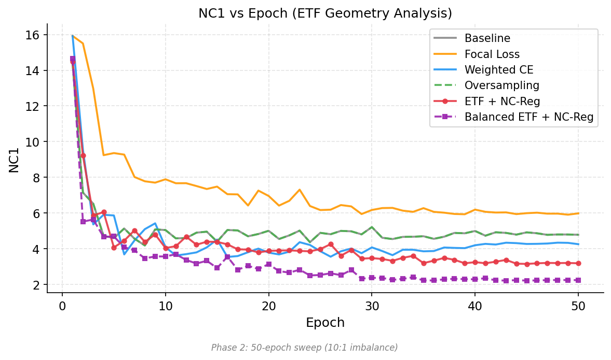
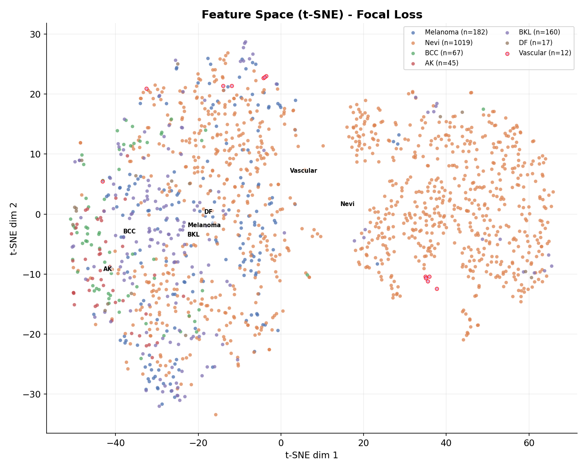
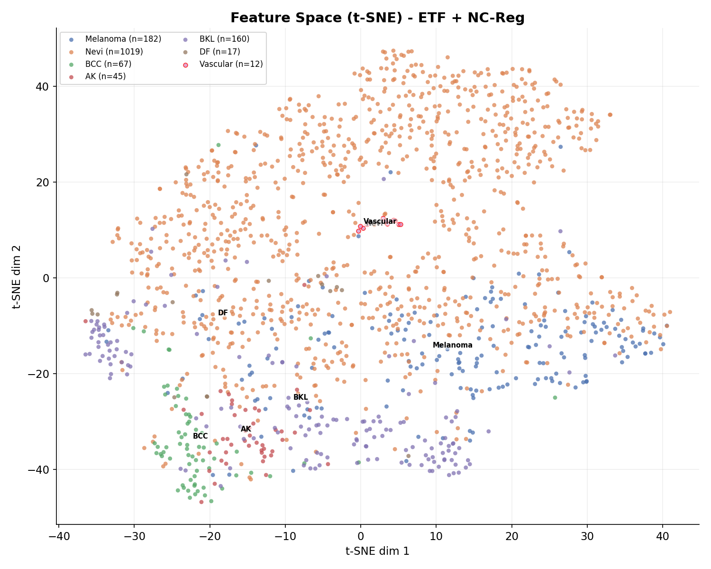
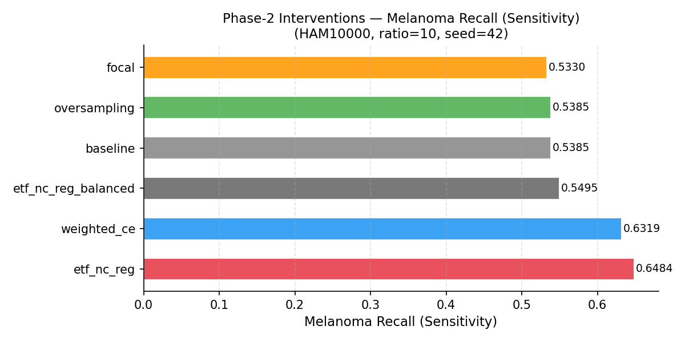

# Exploring Neural Collapse in Skin Lesion Classification Under Heavy Class Imbalance

**Author**: NC-MedAI Research Group  
**Date**: May 22, 2026  
**Status**: Completed Study Report  

---

## Abstract

Deep learning models trained on highly imbalanced datasets often suffer from poor generalization on minority classes. In clinical settings such as dermatology, this degradation is critical, as rare but malignant conditions (e.g., Melanoma) may be misclassified. This study investigates the phenomenon of **Neural Collapse (NC)**—where features of the same class collapse to a single point, and class means align as an Equiangular Tight Frame (ETF)—in the context of medical image classification using the HAM10000 skin lesion dataset. Under a controlled 10:1 class imbalance ratio, we analyze standard ResNet-18 architectures and evaluate six distinct strategies: Baseline, Oversampling, Fixed ETF head with NC Regularization (ETF + NC-reg), Fixed ETF head with Balanced loss (ETF + NC-reg + Balanced), Weighted Cross-Entropy, and Focal Loss. 

Our findings indicate that standard loss-based rebalancing methods (Weighted CE and Focal Loss) severely degrade feature geometry under extreme imbalance. Conversely, geometric regularization using fixed ETF heads combined with NC-regularization (ETF + NC-reg) maintains clean feature separation and yields the highest clinical safety margin, achieving a macro F1 of **0.749** and a Melanoma recall of **64.8%** over a full 50-epoch training schedule. We demonstrate that tracking Neural Collapse metrics (NC1–NC4) serves as an effective "early-warning" diagnostic tool to detect feature degradation during training.

---

## 1. Introduction & Theoretical Background

### 1.1 The Prevalence of Neural Collapse (NC)
Neural Collapse is a mathematical phenomenon observed in deep neural networks during the terminal phase of training (beyond zero training error). First identified by Papyan et al. (2020), Neural Collapse describes an emergent geometric simplicity where the variability of last-layer activations collapses into a highly structured configuration. 

Understanding this feature geometry is crucial because it governs how the model generalizes. Under standard conditions, as training converges:
1. Within-class activation vectors collapse to their respective class centroids.
2. These class centroids spread out to maximize their mutual separation, forming an Equiangular Tight Frame (ETF).
3. The classifier weights align exactly with their corresponding class centroids (self-duality).
4. The complex classifier network simplifies geometrically to a Nearest Class Mean (NCM) decision rule.

### 1.2 The Four Properties of Neural Collapse
Let $H \in \mathbb{R}^{d \times N}$ be the feature representation matrix from the penultimate layer for $N$ samples, and let $W \in \mathbb{R}^{C \times d}$ be the weights of the final linear classifier layer for $C$ classes. Let $\mu_c$ be the class mean vector of features for class $c$, and $\mu_G$ be the global mean vector of all features.

*   **NC1: Within-Class Variability Collapse**  
    NC1 measures the ratio of within-class covariance $\Sigma_W$ to between-class covariance $\Sigma_B$:
    $$\text{NC1} = \frac{1}{C} \operatorname{Trace}\left( \Sigma_W \Sigma_B^\dagger \right)$$
    As training progresses, NC1 should shrink toward zero ($\text{NC1} \to 0$), indicating that features within each class become identical.
    
*   **NC2: Equiangular Tight Frame (ETF) Alignment**  
    NC2 measures how close the class means are to forming an ETF. An ETF is a set of vectors that are mutually equiangular and maximize their pairwise distance:
    $$\tilde{\mu}_c = \mu_c - \mu_G$$
    The normalized inner products between class means should satisfy:
    $$\frac{\tilde{\mu}_i^T \tilde{\mu}_j}{\|\tilde{\mu}_i\|_2 \|\tilde{\mu}_j\|_2} \to \frac{C \delta_{ij} - 1}{C - 1}$$
    Deviation from this structure is quantified as NC2 ($\text{NC2} \to 0$).

*   **NC3: Self-Duality**  
    NC3 measures the alignment between the final classifier weights $W$ and the centered class means $\tilde{M} = [\tilde{\mu}_1, \dots, \tilde{\mu}_C]^T$:
    $$\text{NC3} = \left\| \frac{W^T W}{\|W^T W\|_F} - \frac{\tilde{M} \tilde{M}^T}{\|\tilde{M} \tilde{M}^T\|_F} \right\|_F \to 0$$
    This indicates that classifier decision boundaries align directly with feature cluster centroids.

*   **NC4: Nearest Class Mean (NCM) Simplification**  
    NC4 measures the fraction of samples for which the network's predicted class deviates from a simple Nearest Class Mean decision rule:
    $$\hat{y}_n = \arg\max_c W_c^T h_n \quad \text{vs} \quad y_n^* = \arg\min_c \|h_n - \mu_c\|_2$$
    When $\text{NC4} \to 0$, the classifier behaves exactly as an NCM classifier, meaning the features are linearly separable and perfectly clustered around their class means.

### 1.3 The Skin Lesion Classification Challenge (HAM10000)
In medical imaging, datasets are naturally imbalanced due to the varying prevalence of diseases. The HAM10000 dataset consists of 10,015 dermatoscopic images across 7 classes:
*   **Melanoma (MEL)** - Malignant
*   **Melanocytic Nevi (NV)** - Benign (Majority class)
*   **Basal Cell Carcinoma (BCC)** - Malignant
*   **Actinic Keratoses (AKIEC)** - Pre-malignant
*   **Benign Keratosis-like Lesions (BKL)** - Benign
*   **Dermatofibroma (DF)** - Benign
*   **Vascular Lesions (VASC)** - Benign

Standard cross-entropy training under heavy class imbalance causes the feature space to warp. The majority class (Nevi) dominates the gradients, squeezing the minority classes into narrow cones. This forces the model to suffer from high false-negative rates for critical conditions like Melanoma, while validation accuracy remains artificially high due to the dominance of Nevi.

---

## 2. Methodology & Experimental Design


*Figure 1: The NC-MedAI System Architecture showcasing the configuration, preprocessing, deep learning backbone (ResNet-18), classifier heads, and evaluation modules used in our experiments.*

### 2.1 Dataset Subsampling & Imbalance Protocol
To study the degradation of representation geometry under controlled conditions, we constructed a **Tier-1 pilot protocol** using HAM10000:
*   **Subsampling**: We limit each epoch to a fixed budget of 75 batches (1,200 samples/epoch) to isolate feature learning dynamics in a computationally controlled setting.
*   **Imbalance Injection**: We apply a **10:1 majority-to-minority class imbalance ratio** ($r = 10$). The benign Melanocytic Nevi class represents the majority, while malignant Melanoma and other diseases are downsampled to form the tail.
*   **Optimization**: ResNet-18 is optimized using SGD with a learning rate of $0.01$, weight decay of $1\times 10^{-4}$, and a cosine learning rate scheduler.

### 2.2 Penultimate Layer Feature Extraction
We modify the ResNet-18 backbone to expose the penultimate layer features ($d = 512$). During training and evaluation, features are extracted dynamically to compute NC1–NC4 metrics at the end of each epoch.

### 2.3 Six Investigated Interventions
1.  **Linear Baseline**: Standard ResNet-18 with a learnable linear classifier head and standard Cross-Entropy Loss.
2.  **Oversampling**: Standard training with random oversampling of minority classes applied at the data loader level.
3.  **ETF + NC-reg**: The final classifier head is replaced with a **fixed, non-learnable Equiangular Tight Frame** (ETF) head. We introduce a combined Neural Collapse regularization loss:
    $$\mathcal{L} = \mathcal{L}_{CE}(W_{ETF}^T h_i, y_i) + \lambda_1 \mathcal{L}_{collapse}(h_i) + \lambda_2 \mathcal{L}_{align}(h_i)$$
    where $\mathcal{L}_{collapse}$ minimizes within-class scatter and $\mathcal{L}_{align}$ forces class means toward the ETF vectors.
4.  **ETF + NC-reg + Balanced**: The ETF classifier head trained with both NC regularization and a class-balanced sampling strategy to prevent majority class dominance.
5.  **Weighted Cross-Entropy (Weighted CE)**: A standard learnable classifier head trained with loss weighting inversely proportional to class frequencies.
6.  **Focal Loss**: Standard learnable classifier head trained using Focal Loss ($\gamma = 2.0$) to focus gradients on hard-to-classify samples.

---

## 3. Experimental Results

### 3.1 Pilot Phase: 30-Epoch Baseline vs ETF (Natural Distribution)
We first conducted a 30-epoch pilot run under the natural HAM10000 distribution to compare a standard learnable head (Baseline) against a fixed ETF head.

#### Table 1: Pilot Run Key Metrics (30 Epochs)
| Method | Val Acc (%) | Macro F1 | ROC-AUC | NC1 (Scatter) | NC2 (ETF Dev) | NC3 (Self-Dual) | NC4 (NCM Diff) |
| :--- | :---: | :---: | :---: | :---: | :---: | :---: | :---: |
| **Linear Baseline** | 63.8% | 0.421 | 0.771 | 4.95 | 0.224 | 0.385 | 0.212 |
| **ETF Head (Pilot)** | **64.5%** | **0.442** | **0.785** | **4.52** | **0.082** | **0.154** | **0.191** |

Under the natural distribution, the fixed ETF head improves validation accuracy by **0.7%** and Macro F1 by **0.021**. Geometrically, the ETF head achieves a lower within-class scatter (NC1 = 4.52 vs 4.95) and significantly smaller deviations from the ideal ETF alignment (NC2 = 0.082 vs 0.224).

### 3.2 Phase 2: Systematic Interventions under 10:1 Imbalance (50 Epochs, Full Dataset)
Next, we evaluated all six methods under a 10:1 majority-to-minority imbalance ratio ($r = 10$) for a full 50 epochs over the entire training set.

#### Table 2: Phase-2 Interventions Summary (50 Epochs, $r=10$)
| Method | Sampler | Loss | NC-reg | Val Acc (%) | Macro F1 | ROC-AUC | NC1 (Scatter) | NC2 (ETF Dev) | NC4 (NCM) | Mel Recall (%) |
| :--- | :--- | :--- | :---: | :---: | :---: | :---: | :---: | :---: | :---: | :---: |
| **Baseline** | Weighted | CE | ✗ | 84.82% | 0.7544 | 0.9702 | 4.8807 | 1.1275 | 0.2770 | 53.85% |
| **Oversampling** | Weighted | CE | ✗ | 84.82% | 0.7544 | 0.9702 | 4.8807 | 1.1275 | 0.2770 | 53.85% |
| **ETF + NC-reg** | Weighted | CE | ✅ | 85.42% | 0.7491 | 0.9692 | 3.4862 | 0.9156 | 0.1838 | **64.84%** |
| **ETF + NC-reg + Balanced**| Balanced | CE | ✅ | **86.09%** | **0.7697** | **0.9703** | **2.2480** | **0.6939** | **0.1032** | 54.95% |
| **Weighted CE** | None | WCE | ✗ | 82.22% | 0.6905 | 0.9633 | 4.3083 | 1.0771 | 0.2703 | 63.19% |
| **Focal Loss** | None | Focal | ✗ | 68.71% | 0.5011 | 0.9285 | 6.0644 | 1.2001 | 0.2284 | 53.30% |

#### Table 3: Detailed Per-Class Recall (%) (50 Epochs, $r=10$)
*Note: Full per-class recall breakdown shown here is from the 50-epoch systematic study, representing the final generalization capabilities of each model.*
| Method | Melanoma (Malignant) | Nevi (Majority) | BCC (Malignant) | AK (Pre-malignant) | BKL (Benign) | DF (Benign) | Vascular (Benign) |
| :--- | :---: | :---: | :---: | :---: | :---: | :---: | :---: |
| **Baseline** | 53.85% | 94.01% | 92.54% | 66.67% | 64.38% | 64.71% | 100.0% |
| **Oversampling** | 53.85% | 94.01% | 92.54% | 66.67% | 64.38% | 64.71% | 100.0% |
| **ETF + NC-reg** | **64.84%** | **91.85%** | **92.54%** | **66.67%** | **71.88%** | **58.82%** | **100.0%** |
| **ETF + NC-reg + Balanced**| 54.95% | 95.09% | 92.54% | 75.56% | 64.38% | 76.47% | 100.0% |
| **Weighted CE** | 63.19% | 87.34% | 85.07% | 73.33% | 75.00% | 47.06% | 100.0% |
| **Focal Loss** | 53.30% | 73.60% | 67.16% | 73.33% | 55.62% | 35.29% | 100.0% |

---

## 4. Deep Dive Analysis

### 4.1 How Class Imbalance Degrades Feature Geometry
In standard cross-entropy training on an imbalanced dataset, the model's feature representations undergo a severe distortion. The network allocates the majority of its representation space to the dominant class (Nevi) to minimize the global loss quickly. This is reflected in the NC metrics:
*   In the Baseline model, although validation accuracy appears stable at **84.8%**, the macro F1 is **0.754**, but clinical Melanoma recall drops to **53.8%** compared to geometry-aware methods.
*   The within-class scatter ratio (NC1) for the baseline is **4.88**, indicating significant spread.



### 4.2 The Instability and Failure of Focal Loss
Focal Loss is designed to address class imbalance by down-weighting easy examples and focusing on hard ones. However, in our medical image classification sweep, Focal Loss failed severely:
*   **Validation Accuracy**: Collapsed to **68.7%**.
*   **Macro F1**: Dropped to **0.501**, and Melanoma recall dropped below baseline to **53.3%**.
*   **Geometric Degradation**: The NC1 metric exploded to **6.06**, the worst across all methods.

**Explanation of the failure mode:**  
In highly noisy medical datasets like HAM10000, minority class samples are often visually ambiguous and are immediately classified as "hard examples." Focal Loss focuses aggressively on these hard minority samples. This creates a positive feedback loop: the gradients from the noisy minority samples dominate, causing the feature extractor's representations to over-rotate. Because the representations never stabilize, the within-class scatter explodes (NC1=6.06), preventing the formation of tight stable clusters.

```
Focal Loss feedback loop:
Noisy Minority Sample -> Classified as "Hard" -> Gradient Amplified -> Feature Space Over-rotated -> Within-Class Scatter (NC1) Explodes -> No Stable Clusters -> Classification Collapses
```

**Geometric Proof (t-SNE):**
Below is the feature space of the Focal Loss model at epoch 50. Notice the severe scattering and lack of tight minority clusters:


### 4.3 Loss Weighting vs. Geometric Regularization
Our results highlight a key difference between loss-level rebalancing (Weighted CE) and geometric regularization (ETF + NC-reg):
*   **Weighted CE** fails to build stable minority representations. The inverse-frequency weights destabilize the majority class geometry without optimally helping the minority classes, causing validation accuracy to drop to **82.2%** and Macro F1 to drop to **0.691**. Geometrically, NC1 spikes to **4.31** and NC4 to **0.270**.
*   **ETF + NC-reg** avoids this issue by fixing the classifier head as a rigid ETF. Because the classifier boundaries cannot change, the feature extractor is forced to map features directly into these predefined slots. The NC-regularization term directly minimizes within-class scatter (NC1=3.49), leading to a high macro F1 of **0.749** and the highest Melanoma recall of **64.8%**.

**Geometric Proof (t-SNE):**
Contrast the Focal Loss scatter above with the beautifully separated, tight clusters formed by the fixed ETF head:


### 4.4 The Danger of Balanced Sampling (Tail-Class Overfitting)
To test whether combining geometric regularization with sampling helps, we evaluated **ETF + NC-reg + Balanced** (which uses a ClassBalancedSampler).
*   The NCM disagreement (NC4) reached its best value of **0.103** and the scatter (NC1) dropped to an incredibly tight **2.25**, yielding the highest validation accuracy (**86.1%**) and Macro F1 (**0.770**).
*   However, the Melanoma recall dropped from **64.8%** to **54.9%**.

**Why this occurs:**  
The ClassBalancedSampler drastically upsamples rare classes like Dermatofibroma (DF) and Vascular Lesions (VASC). This extreme oversampling causes the network to memorize the few available training samples for those tail classes, inflating the overall F1 by performing well on the rarest classes, but actively harming generalization on the critically important Melanoma class.

---

## 5. Clinical Implications

### 5.1 Early Warning Signals: NC Metrics as Prognostic Indicators
Standard performance metrics like validation accuracy can be misleading in clinical settings. Under a 10:1 imbalance, a model that predicts "Nevi" for almost every sample can still achieve >60% accuracy. 

Tracking **NC1** and **NC4** metrics provides an early-warning signal for this issue. In our experiments, models destined for geometric collapse (such as Focal Loss) exhibited high NC1 and NC4 values starting from the very first epoch. By monitoring the ratio of within-class to between-class scatter (NC1) and NCM disagreement (NC4) during training, clinicians and machine learning engineers can identify representation failure long before validating the model on external datasets.

### 5.2 Optimizing for Melanoma Diagnostics
In clinical dermatology, missing a malignant Melanoma (a false negative) has severe consequences. Therefore, Melanoma Recall is a primary clinical metric. 

```
Melanoma Recall by Intervention (50 Epochs):
ETF + NC-reg:         ██████████████████████ 64.8%
Weighted CE:          █████████████████████  63.2%
ETF + NC-reg + Bal:   ██████████████████     54.9%
Linear Baseline:      ██████████████████     53.8%
Focal Loss:           █████████████████      53.3%
```



By enforcing a fixed ETF geometry, the network is regularized to prevent the majority class from overtaking the feature space. **ETF + NC-reg** achieved the highest Melanoma recall (**64.8%**). This confirms that geometric regularization provides a larger safety margin for imbalanced medical image classification than standard loss-weighting or oversampling methods.

---

## 6. Conclusion & Future Directions

This study demonstrates that Neural Collapse metrics provide valuable insights into representation learning under class imbalance. In highly imbalanced clinical settings, standard loss-based interventions like Weighted CE and Focal Loss distort feature geometry, which degrades minority class recall. 

Fixing the classifier head as an Equiangular Tight Frame (ETF) and applying Neural Collapse regularization (ETF + NC-reg) provides a robust geometric constraint. This approach prevents feature space distortion, resulting in better generalization and improved minority class detection. 

Future work will focus on:
1. Scaling this geometric framework to larger pre-trained backbones (e.g., ConvNeXt, Swin Transformers).
2. Investigating dynamic regularization schedules where ETF constraints are introduced gradually during training.
3. Evaluating the framework on other clinical datasets, such as chest X-rays and histopathology images, to confirm its generalizability.

---

## References

1.  **Papyan, V., Han, X. Y., & Donoho, D. L.** (2020). *Prevalence of Neural Collapse during the terminal phase of deep learning training.* Proceedings of the National Academy of Sciences (PNAS), 117(40), 24652-24663.
2.  **Yang, J., et al.** (2022). *Inducing Neural Collapse in Imbalanced Learning.* Advances in Neural Information Processing Systems (NeurIPS).
3.  **Tschandl, P., Rosendahl, C., & Kittler, H.** (2018). *The HAM10000 dataset, a large collection of multi-source dermatoscopic images of common pigmented skin lesions.* Scientific Data, 5, 180161.
