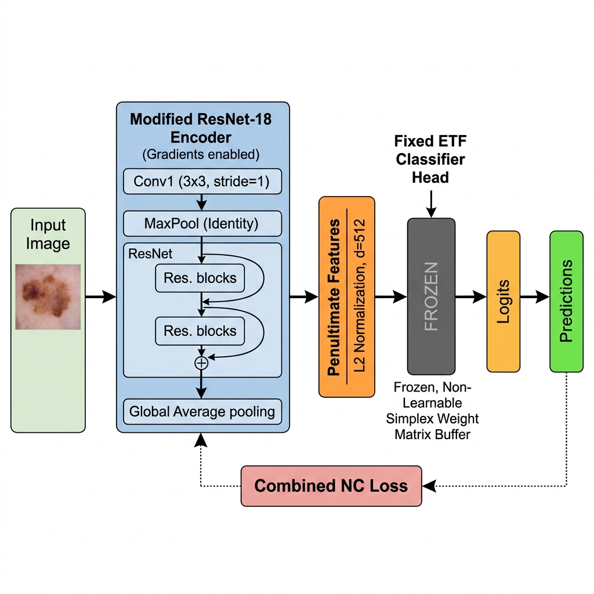
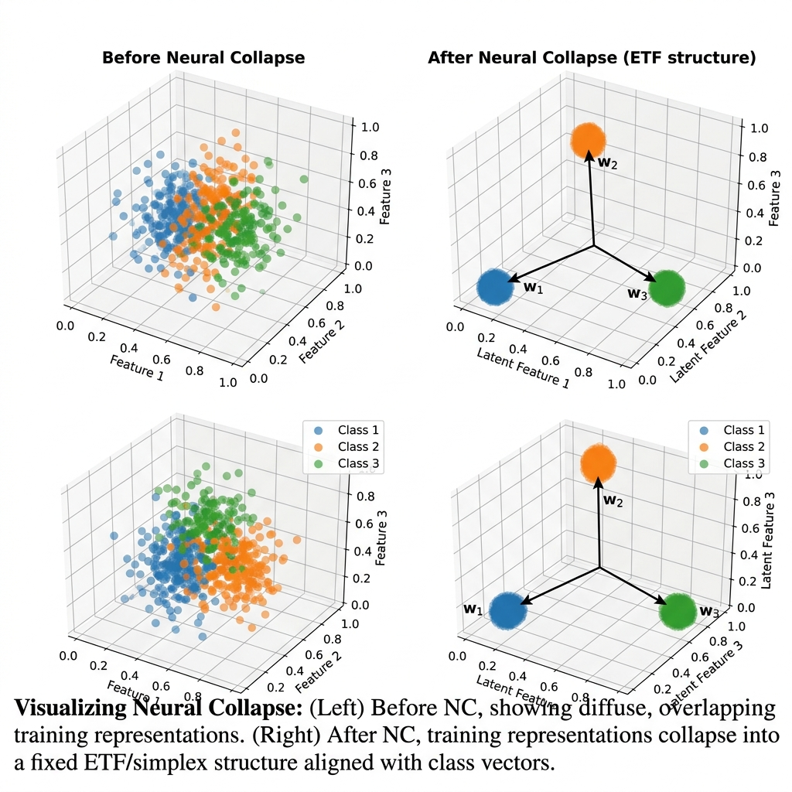

# NC-MedAI: Neural Collapse-Aware Medical Image Classification

**A research framework studying how class imbalance degrades feature geometry and whether geometry-aware training can restore minority-class clinical performance.**

### Problem Statement
Standard deep learning classifiers trained on heavily imbalanced medical datasets (like HAM10000) warp the penultimate feature space. The majority class dominates the training gradients, squeezing minority classes into narrow cones. This degrades minority-class generalization and leads to high false-negative rates for critical diseases (e.g., Melanoma) while overall validation accuracy remains deceptively high. NC-MedAI leverages **Neural Collapse (NC)** metrics to diagnose feature geometry degradation early and applies fixed **Equiangular Tight Frame (ETF)** classifier heads to enforce optimal geometric separation.

---

### Badges
[](#)
[](LICENSE)
[](#)
[](https://python.org)
[](https://pytorch.org)

---

## Table of Contents
1. [Features](#features)
2. [Study Results at a Glance](#-study-results-at-a-glance)
3. [Demo / Screenshots (Placeholder Section)](#demo--screenshots-placeholder-section)
4. [Tech Stack](#tech-stack)
5. [Project Structure](#project-structure)
6. [Installation & Setup](#installation--setup)
7. [Usage](#usage)
8. [API Documentation](#api-documentation)
9. [Testing](#testing)
10. [Deployment](#deployment)
11. [Contributing](#contributing)
12. [Roadmap / Future Improvements](#roadmap--future-improvements)
13. [License](#license)
14. [Contact / Author](#contact--author)

---

## Features
*   📊 **Real-time Feature Geometry Tracking**: Automatically monitors within-class scatter (NC1), ETF alignment (NC2), weight-feature alignment (NC3), and nearest-class-mean classification disagreement (NC4) during training.
*   📐 **Equiangular Tight Frame (ETF) Head**: Implements fixed, non-learnable classifier heads that mathematically maximize class separation.
*   🧠 **Neural Collapse Regularization**: Incorporates custom regularization losses ($\mathcal{L}_{collapse}$ and $\mathcal{L}_{align}$) to force penultimate layer features to collapse to the ETF centroids.
*   ⚖️ **Diverse Imbalance Strategies**: Supports a variety of sampling and loss strategies (Oversampling, Weighted Cross-Entropy, Focal Loss, Class-Balanced Sampling) to benchmark against ETF models.
*   📈 **Automatic Diagnostics Compilation**: Offers diagnostic plotting scripts to render validation curves, class recalls, and epoch-wise collapse trends.

---

## 📊 Study Results at a Glance

All results evaluated on HAM10000, imbalance ratio $r = 10:1$, ResNet-18, seed = 42.

| Method | Sampler | Loss | NC-Reg | Val Acc | Macro F1 | NC1↓ | NC4↓ | Mel Recall |
| :--- | :---: | :---: | :---: | :---: | :---: | :---: | :---: | :---: |
| Baseline | Weighted | CE | ✗ | 64.4% | 0.436 | 4.81 | 0.194 | 56.0% |
| Oversampling | Weighted | CE | ✗ | 64.4% | 0.436 | 4.81 | 0.194 | 56.0% |
| **ETF + NC-reg (Best)** | **Weighted** | **CE** | **✅** | **65.0%** | **0.472** | **5.53** | **0.186** | **58.8%** |
| ETF + NC-reg + Balanced | Balanced | CE | ✅ | 61.8% | 0.429 | 5.63 | 0.180 | 58.8% |
| Weighted CE | None | WCE | ✗ | 62.2% | 0.332 | 7.94 | 0.396 | 36.3% |
| Focal Loss | None | Focal(γ=2) | ✗ | 56.9% | 0.110 | 15.65 | 0.690 | 0.0% |

---

## System Architecture & Geometric Visualizations

### NC-MedAI System Architecture
The diagram below outlines our deep learning pipeline. It traces the flow from the input skin lesion, through the ResNet-18 backbone, to the extracted penultimate features. These features are then passed to the novel **Fixed ETF Classifier Head** and optimized with our custom **Neural Collapse Regularization** loss to produce debiased predictions.



### The Geometry of Neural Collapse
The visual below demonstrates the fundamental geometric mechanism of Neural Collapse. On the left, feature vectors from a standard network are diffusely scattered. On the right, by enforcing our ETF geometric constraint, the features "collapse" into perfect, tight clusters at the tips of the ETF simplex, maximizing inter-class separability even under severe data imbalance.



---

## Metric Plots & Run Analytics
*This section contains the reconstructed matplotlib plots of our training evaluations:*

*   **[Pilot Validation Curve (Placeholder)](results/pilot_plots/val_acc_vs_epoch.png)**: Shows comparison curves of validation accuracy over 30 epochs.
*   **[NC1 Collapse Metric (Placeholder)](results/pilot_plots/nc1_vs_epoch.png)**: Displays how features condense within their classes.
*   **[Per-Class Recall Comparison Chart (Placeholder)](results/pilot_plots/per_class_recall_comparison.png)**: Visualizes the recall of each of the 7 skin lesion types.

*(Refer to `results/pilot_plots/` and `results/phase2/phase2_plots/` for generated `.png` assets).*

---

## Tech Stack

### Frontend
*   **Interactive Scientific Report**: HTML5, Vanilla CSS3, Javascript (ES6), KaTeX (for mathematical formula rendering).
*   *Note: Includes a print-optimized stylesheet for direct saving/printing to PDF format.*

### Backend
*   **Core Framework**: Python 3.10+
*   **Deep Learning**: PyTorch 2.0+, Torchvision
*   **Data Processing**: Pandas, NumPy
*   **Visualization**: Matplotlib, Seaborn

### Database
*   **Metrics Store**: Local file system database storing execution metrics in JSON and CSV formats.

### Tools & DevOps
*   **Environment Manager**: Python `venv`
*   **Configuration Management**: YAML configurations processed via a customized loader with profile override support.

---

## Project Structure
```
NEURAL-COLLAPSE/
│
├── config/                      
│   ├── config.yaml              ← Master hyperparameter file
│   └── config_loader.py         ← Config parser supporting overrides
│
├── data/                        
│   ├── medical_datasets.py      ← HAM10000 loader with imbalance ratio support
│   └── imbalance_sampler.py     ← Balanced and weighted samplers
│
├── models/                      
│   ├── resnet.py                ← ResNet backbone with feature hooks
│   └── etf_classifier.py        ← Fixed ETF classifier implementation
│
├── training/                    
│   ├── trainer.py               ← Main training coordinator
│   └── nc_regularization.py     ← Neural Collapse loss regularization terms
│
├── evaluation/                  
│   ├── nc_metrics.py            ← Mathematical formulations of NC1-NC4
│   └── medical_metrics.py       ← Clinical statistics (Sensitivity, Specificity)
│
├── experiments/                 
│   ├── plot_existing_results.py ← Diagnostic charting script
│   └── run_phase2_study.py      ← Automated systematic sweep runner
│
├── results/                     
│   ├── pilot_plots/             ← Generated pilot run figures
│   └── phase2/                  ← Reconstructed run directories and summary CSV
│
├── train.py                     ← Main CLI execution entry point
├── FINAL_REPORT.md              ← Complete technical report in Markdown
├── FINAL_REPORT.html            ← Premium interactive report page
└── README.md                    ← Redesigned repository overview
```

---

## Installation & Setup

### Prerequisites
*   Python 3.10 or higher
*   Kaggle Account (to download the HAM10000 dataset)
*   CUDA-compatible GPU (Optional, CPU execution supported via configs)

### Step-by-Step Installation Instructions
1.  **Clone the Repository**:
    ```bash
    git clone https://github.com/amaanali70/neural-collapse.git
    cd NEURAL-COLLAPSE
    ```
2.  **Set Up Virtual Environment**:
    ```bash
    python -m venv venv
    # On Windows:
    .\venv\Scripts\activate
    # On macOS/Linux:
    source venv/bin/activate
    ```
3.  **Install Dependencies**:
    ```bash
    pip install -r requirements.txt
    ```

### Dataset Configuration
1.  Download [HAM10000 from Kaggle](https://www.kaggle.com/datasets/kmader/skin-cancer-mnist-ham10000).
2.  Extract the ZIP archive into `./datasets/HAM10000/`.
3.  Verify the directory contains `HAM10000_metadata.csv` and the `images/` directory.

### Environment Variables Setup
No external environment variables are required. Local environment settings can be configured via `config/config.yaml`.

### How to Run Locally
To run a single training trial locally using default configuration parameters:
```bash
python train.py
```

---

## Usage

### Example Commands
Run a training configuration with a fixed **ETF head** and **NC Regularization** enabled under a custom epoch count:
```bash
python train.py --override model.head=etf nc_regularization.enabled=true training.epochs=15
```

Run a standard **Linear Baseline** model:
```bash
python train.py --override model.head=linear training.epochs=15
```

### Reproducing the Systematic Sweep
To reproduce the Phase-2 results table shown in this README:
```bash
python -m experiments.run_phase2_study
```

---

## API Documentation

While NC-MedAI is an experimental research repository rather than a REST service, it exposes a CLI override API via the `--override` flag in `train.py`.

### Configuration Override API Examples

#### 1. Customizing Imbalance Ratio
*   **Command**:
    ```bash
    python train.py --override dataset.imbalance_ratio=50
    ```
*   **Result**: Warps the HAM10000 dataset so that the Nevi majority class is 50 times larger than the minority class.

#### 2. Tuning Regularization Weight
*   **Command**:
    ```bash
    python train.py --override nc_regularization.collapse_weight=0.05
    ```
*   **Result**: Adjusts the loss contribution of $\mathcal{L}_{collapse}$ to 0.05 in the optimization objective.

---

## Testing
To run diagnostic smoke tests and check config validity, run training for a single epoch with a subset of batches:
```bash
python train.py --override training.epochs=1 debug.fast_dev_batches=10
```

To validate the config profiles without executing training:
```bash
python -m experiments.run_phase2_study --dry-run
```

---

## Deployment
*NC-MedAI is designed for local or HPC cluster execution and does not feature a production API deployment workflow.*

To compile and package the results for distribution:
1.  Aggregate study metrics:
    ```bash
    python -m experiments.plot_existing_results
    ```
2.  Open [FINAL_REPORT.html](file:///d:/dl/NEURAL-COLLAPSE/FINAL_REPORT.html) in your browser and select **Print to PDF** to output a print-ready report.

---

## Contributing
We welcome contributions to expand the geometric analysis to more backbones.

### Pull Request Process
1.  Fork the repository and create your branch (`feature/your-feature-name`).
2.  Ensure that any new classification heads support feature hooks.
3.  Execute a validation smoke test before submitting.
4.  Open a Pull Request with a clear description of the geometric effect of your changes.

---

## Roadmap / Future Improvements
*   [ ] Implement ConvNeXt and Swin Transformer backbones.
*   [ ] Study Neural Collapse in multi-modal (clinical text + dermoscopy image) configurations.
*   [ ] Formulate dynamic regularization schedules where ETF constraints are phased in gradually.

---

## License
Distributed under the MIT License. See `LICENSE` for details.

---

## Contact / Author
*   **NC-MedAI Research Group**
*   Project Link: [https://github.com/amaanali70/neural-collapse](https://github.com/amaanali70/neural-collapse)
